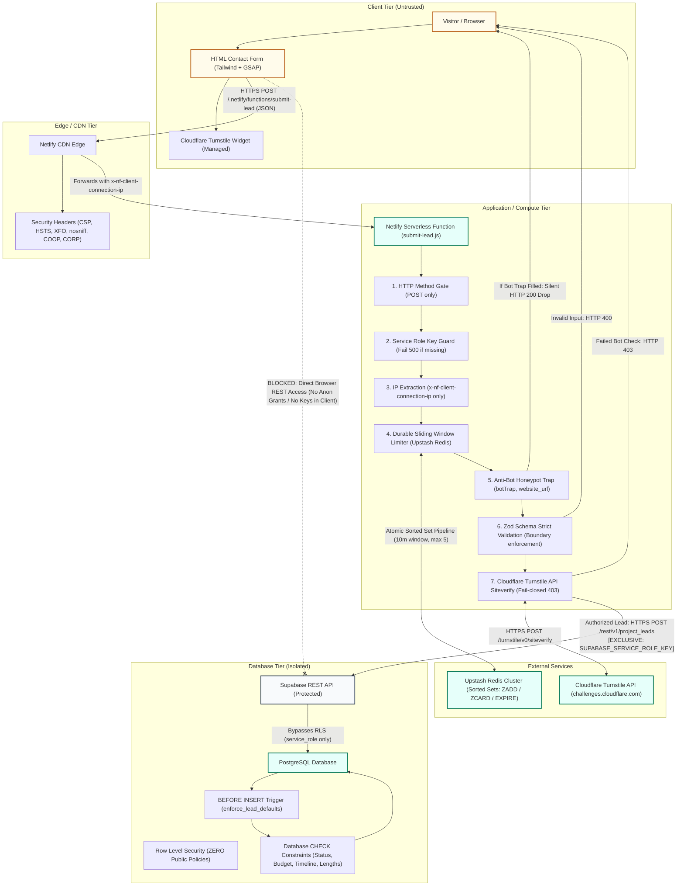

# Builtbyus Studio — Security Architecture Diagram

This document illustrates the end-to-end security architecture of **Builtbyus Studio** following the full security remediation.

---

## 1. High-Level Architecture Flow

---

## 2. Security Trust Boundaries & Defense in Depth

### Layer 1: Client Browser (Zero Trust)
- **Zero Client Credentials:** No Supabase publishable keys, anon keys, or service role keys exist in the client-side JavaScript or HTML bundle.
- **Single Submission Path:** The frontend form submits strictly to `/.netlify/functions/submit-lead`.
- **Content Security Policy (CSP):** Browser connections are restricted to `'self'` and `https://challenges.cloudflare.com`. Public connections to database endpoints are explicitly disallowed.

### Layer 2: Edge CDN (Netlify)
- **Authoritative IP Tracking:** Netlify sets `x-nf-client-connection-ip`. Client-supplied `X-Forwarded-For` headers are strictly ignored by backend code to prevent rate limit spoofing.
- **Authoritative Security Headers:**
  - `Strict-Transport-Security: max-age=31536000; includeSubDomains; preload`
  - `X-Content-Type-Options: nosniff`
  - `X-Frame-Options: SAMEORIGIN`
  - `Referrer-Policy: strict-origin-when-cross-origin`
  - `Permissions-Policy: camera=(), microphone=(), geolocation=(), payment=()`
  - `Cross-Origin-Opener-Policy: same-origin`
  - `Cross-Origin-Resource-Policy: same-origin`

### Layer 3: Serverless Function (`submit-lead.js`)
- **Key Requirement Guard:** The function mandates `SUPABASE_SERVICE_ROLE_KEY`. If omitted, the handler immediately returns `500 Server Configuration Error`.
- **Durable Sliding-Window Rate Limiter:**
  - Backend: Upstash Redis sorted sets (`ZREMRANGEBYSCORE`, `ZADD`, `ZCARD`, `EXPIRE`).
  - Window: Rolling 10 minutes (600 seconds).
  - Limit: Maximum 5 submissions per connection IP per rolling window.
  - Fail-safe: In-memory sliding-window fallback if Redis is unavailable.
- **Honeypot Bot Defense:** Hidden fields (`botTrap`, `website_url`) silently return `200 OK` to bots without saving to the database.
- **Strict Input Validation (Zod):**
  - Schema configured with `.strict()` to reject unexpected fields.
  - Strict length limits: `name` (1–100 chars), `email` (valid format, max 255 chars, lowercased), `message`/`details` (max 2000 chars), `budget` and `timeline` (strictly whitelisted enums).
- **Server-to-Server CAPTCHA Verification:** Cloudflare Turnstile token validated server-to-server with `TURNSTILE_SECRET_KEY`. Fails closed (`403 Forbidden`) if verification fails or network times out.

### Layer 4: PostgreSQL Database (Supabase)
- **Zero Public Permissions:**
  - `REVOKE ALL ON public.project_leads FROM anon, authenticated;`
  - `REVOKE USAGE, SELECT ON ALL SEQUENCES IN SCHEMA public FROM anon, authenticated;`
  - Row Level Security (RLS) is enabled with zero policies for public roles.
- **Exclusive Service Role Access:**
  - Only `service_role` has permissions to interact with `project_leads`.
  - In Supabase PostgreSQL, `service_role` bypasses RLS, ensuring that only trusted backend functions can write leads.
- **Postgres Defaults & Tamper-Proof Trigger:**
  - `trg_enforce_lead_defaults` triggers `BEFORE INSERT`, guaranteeing `status = 'new'` and `created_at = NOW()`.
  - Callers cannot forge status (e.g. mark as `closed`) or backdate leads.
- **Database CHECK Constraints:**
  - Enforces status in `('new', 'contacted', 'qualified', 'converted', 'archived')`.
  - Enforces allowed budget and timeline values.
  - Enforces text length and valid email regex.
